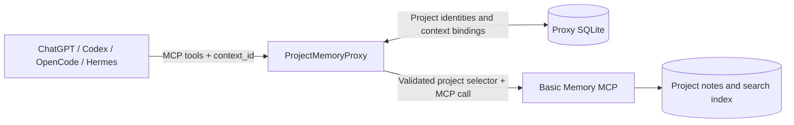

# ProjectMemoryProxy

   

**Project-scoped, shared memory for self-hosted AI assistants.**

ProjectMemoryProxy is a lightweight [Model Context Protocol (MCP)](https://modelcontextprotocol.io/) server that sits in front of [Basic Memory](https://github.com/basicmachines-co/basic-memory). It lets multiple AI clients share a project's persistent knowledge while keeping requests routed to the intended Basic Memory project.

**Basic Memory stores and searches the memories. ProjectMemoryProxy decides which project a request belongs to.**

## Why it exists

AI assistants often work on the same project in different places: a ChatGPT Project for planning, Codex or OpenCode for implementation, and Hermes for longer-running tasks. They should be able to use the **same project memory** without mixing it with notes from unrelated projects.

ProjectMemoryProxy provides one explicit routing layer instead of relying on each client to choose a Basic Memory project correctly. Clients supply a technical `context_id`; the proxy resolves it through an exact, preconfigured binding. An unknown or inactive binding cannot silently fall back to another project.

### Example

| Client context | Basic Memory project |
| --- | --- |
| `chatgpt-project:my-app` | `my-app` |
| `git:github.com/example/my-app` | `my-app` |
| `chatgpt-project:home-automation` | `home-automation` |

The first two contexts can share notes, architectural decisions, and project history because both are explicitly bound to the same Basic Memory project. The third context uses a different project and remains logically separate.

Bindings are **explicit**: ProjectMemoryProxy does not guess the context from a conversation, repository name, or topic. The client must provide the appropriate `context_id` with project-scoped tool calls.

## How it works

1. **Discover tools.** On startup, the proxy connects to Basic Memory, discovers its MCP tools, and exposes only tools whose project routing can be controlled safely. Tool schemas are adapted so clients cannot override the upstream project selector.
2. **Reconcile projects.** The proxy compares Basic Memory's project inventory with its local SQLite registry. It registers newly discovered project identities and deactivates missing ones, but **never creates context bindings automatically**.
3. **Resolve a request.** For a project-scoped call such as `search_notes`, `read_note`, or `write_note`, the proxy validates the supplied `context_id` and requires an active binding to an active project routing.
4. **Forward to Basic Memory.** The proxy removes client-controlled routing arguments, injects the validated Basic Memory project UUID or name as required by the upstream tool, and returns the MCP result.
5. **Fail closed.** Missing bindings, inconsistent project identities, and upstream tools with unsafe or unknown routing semantics are rejected rather than guessed.

Each Basic Memory project has a **human-readable name** and a **UUID assigned by Basic Memory**. ProjectMemoryProxy keeps this pair consistent in its own SQLite control plane. A `project_path` supplied when creating a project is different: it is an absolute filesystem path on the Basic Memory host/container, not the project's name or UUID.

The proxy does **not** access Basic Memory's internal database or store a second copy of the notes. Basic Memory remains responsible for persistence, indexing, search, and the memory content itself.

## Project management through MCP

Trusted clients can manage projects and their bindings through the same MCP connection:

| Purpose | MCP tools |
| --- | --- |
| Inspect routing | `resolve_context`, `list_projects`, `list_context_bindings` |
| Create or delete projects | `create_project`, `delete_project` |
| Connect or disconnect contexts | `bind_context`, `unbind_context` |

Project creation and deletion are carried out through Basic Memory's lifecycle tools, with identity validation and recovery handling in the proxy. `basic_memory_diagnostics` is also exposed as a global diagnostic tool without a project context.

## Scope and trust model

ProjectMemoryProxy is designed for **private, self-hosted Basic Memory installations and trusted MCP clients**. It is not a public multi-tenant authorization service: `context_id` is a routing selector, **not proof of a client's identity**. Administrative tools are intentionally available on the MCP endpoint, so access should be restricted to trusted clients and networks or provided through an appropriate secure tunnel.

The current scope is deliberately narrow:

- Local/self-hosted Basic Memory projects; no Basic Memory Cloud workspace or tenant routing.
- Explicit project-scoped memories; no cross-project or general-knowledge memory layer.
- The Basic Memory compatibility tools `search` and `fetch` are not exposed because they do not carry the required explicit `context_id`. Use the routed `search_notes` and `read_note` tools instead.

## Running ProjectMemoryProxy

The repository provides a [Docker image](https://github.com/ChrSchu90/ProjectMemoryProxy/pkgs/container/project-memory-proxy) and an [example Docker Compose stack](examples/compose.yml) combining Basic Memory, ProjectMemoryProxy, and the OpenAI Secure MCP Tunnel. ProjectMemoryProxy keeps its own routing metadata in a persistent data directory.

**MCP endpoint:** ProjectMemoryProxy exposes its Streamable HTTP endpoint at `/mcp`. The example Docker Compose configuration uses `http://project-memory-proxy:8000/mcp`.

The health endpoints are available separately:

- `/health/live` — Liveness check.
- `/health/ready` — Readiness check, including Basic Memory connectivity.

The implementation and test suite are in place; deployment and migration of existing clients from direct Basic Memory access to the proxy are separate steps.
